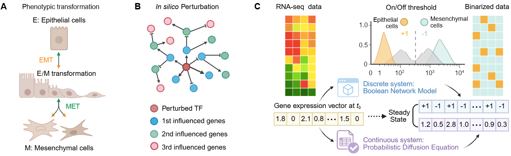

# [CellLand for Cell dynamics on energy Landscapes](https://github.com/zpliulab/CellLand)

**CellLand** bundles **PCA and energy-landscape visualizations** (EMT, melanoma traces, SERGIO-style examples) with mirrored input data, and a **vendored copy of `bmodel`** under `Code/bmodel/`. You can run the Jupyter workflows from this folder directly.




---

## CellLand

<!--START_SECTION:news-->

* **CellLand** (**Cell** dynamics on energy **Land**scapes) is a comprehensive pipeline for benchmarking attractor detection in Boolean-network and diffusion-based models under *in silico* driver gene perturbations.
* Questions about **CellLand** itself are best directed to the last corresponding author **[Prof. Zhi-Ping Liu](https://scholar.google.com/citations?user=zkBXb_kAAAAJ&hl=zh-CN&oi=ao)** (e-mail: zpliu@sdu.edu.cn).

<!--END_SECTION:news-->


---

## Citation

Lingyu Li, Liangjie Sun, Shumin Li, Wai-Ki Ching*, and Zhi-Ping Liu*. "**Cell dynamics on energy landscapes: Comparing attractor detection in Boolean-network and diffusion-based models under *in silico* driver gene perturbations**." Submitted and revised to [Quantitative Biology](https://onlinelibrary.wiley.com/journal/20954697).


---

## Conda environment

Use **64-bit Python 3.10 or 3.11** (works well with numpy, scipy, numba, scikit-learn).

```bash
conda create -n CellLand python=3.11 -y
conda activate CellLand
conda install -c conda-forge numpy pandas scipy matplotlib scikit-learn jupyterlab seaborn -y
```

---

## Installing **bmodel** (Boolean model package, vendored copy)

The notebooks can load **`Code/bmodel/`** via `sys.path` without installing. For a stable environment or **`pytest`**:

```bash
conda activate CellLand
cd Code/bmodel
pip install -e .
```

Dependencies from `setup.py`: **numpy**, **numba**, **pandas**, **scipy**.

```bash
python -c "from bmodel.base import Bmodel; print(Bmodel)"
cd Code/bmodel && pytest -v   # optional
```

Upstream package: [ComplexityBiosystems/bmodel](https://github.com/ComplexityBiosystems/bmodel).

---

## Running the notebooks

1. Add **`Data/`** (mirrored layout) and allow **`Result/`** to be created on save.
2. `conda activate CellLand`
3. Start Jupyter; open **`Code/PCA_visualization.ipynb`**.
4. Run **from the top** so `ROOT`, `DATA_DIR_S`, `RESULT_DIR_S`, and `base` imports are defined.
5. Prefer working directory **repository `Code/`** or **repository root**; notebooks resolve `base.py` and `bmodel` from there.

**Renaming the folder:** Notebooks fall back to `Path('.../Bmodel/CellLand')` when auto-detection fails—edit that literal to match your machine after you rename the checkout (e.g. from a temporary folder name to **`CellLand`**).


---

## License

See the `LICENSE` file in this repository.
